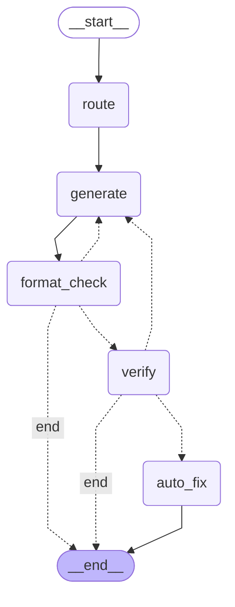

```mermaid
---
config:
  flowchart:
    curve: linear
---
graph TD;
	__start__([<p>__start__</p>]):::first
	route(route)
	generate(generate)
	format_check(format_check)
	verify(verify)
	auto_fix(auto_fix)
	__end__([<p>__end__</p>]):::last
	__start__ --> route;
	format_check -. &nbsp;end&nbsp; .-> __end__;
	format_check -.-> generate;
	format_check -.-> verify;
	generate --> format_check;
	route --> generate;
	verify -. &nbsp;end&nbsp; .-> __end__;
	verify -.-> auto_fix;
	verify -.-> generate;
	auto_fix --> __end__;
	classDef default fill:#f2f0ff,line-height:1.2
	classDef first fill-opacity:0
	classDef last fill:#bfb6fc

```
